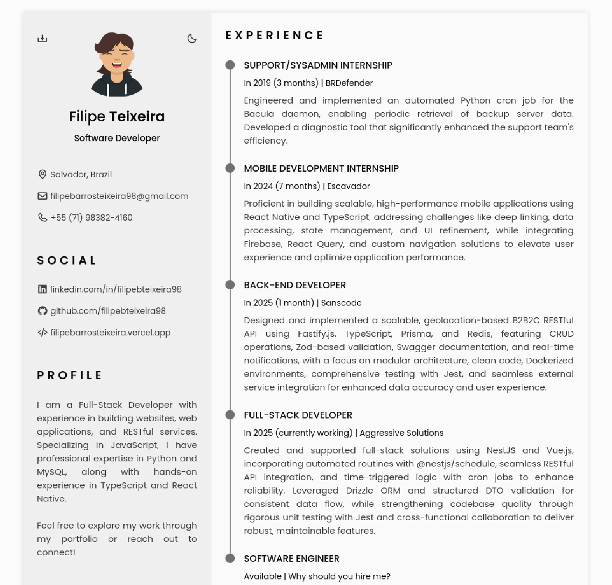

<h1 align="center"> Professional Resume </h1>

<p align="center">
  
  
  
  
  
  
  
</p>

<p align="center">
  <a href="#-technologies">Technologies</a>&nbsp;&nbsp;&nbsp;|&nbsp;&nbsp;&nbsp;
  <a href="#-project">Project</a>&nbsp;&nbsp;&nbsp;|&nbsp;&nbsp;&nbsp;
  <a href="#-layout">Layout</a>&nbsp;&nbsp;&nbsp;|&nbsp;&nbsp;&nbsp;
  <a href="#memo-licença">Licença</a>
</p>

<p align="center">
  
</p>

<br>

<p align="center">
  
</p>

## 🚀 Technologies

This project was developed with the following technologies:

- HTML e CSS
- JavaScript
- Git e Github
- Figma

## 💻 Project

This repository hosts my responsive resume website, developed using core web technologies (HTML, CSS, JS). It's deployed online for easy public access and demonstrates my front-end capabilities.

## 💻 How to run

```bash
# Clone the repository
git clone https://github.com/filipebteixeira98/profile.git

# Access the project folder
cd profile

# Open the index.html file in your browser
open index.html
```

## 📝 License

This project is under the MIT license.

<p align="center">
  Made with ♥ by me
</p>
